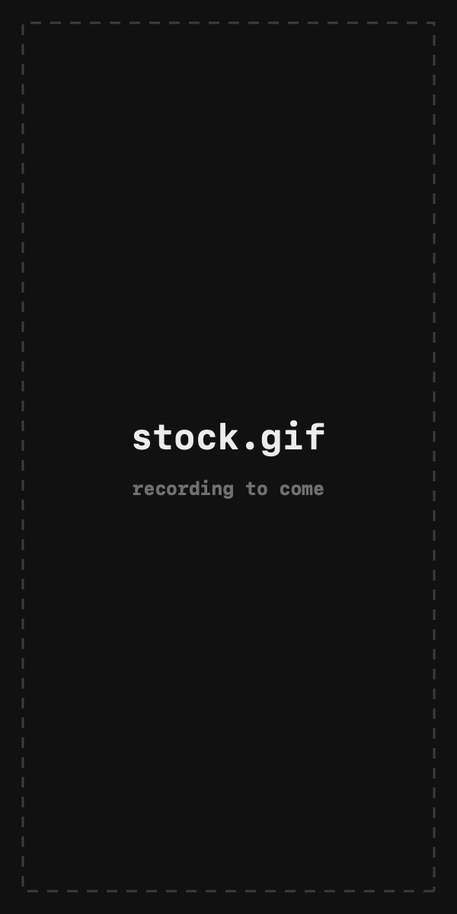
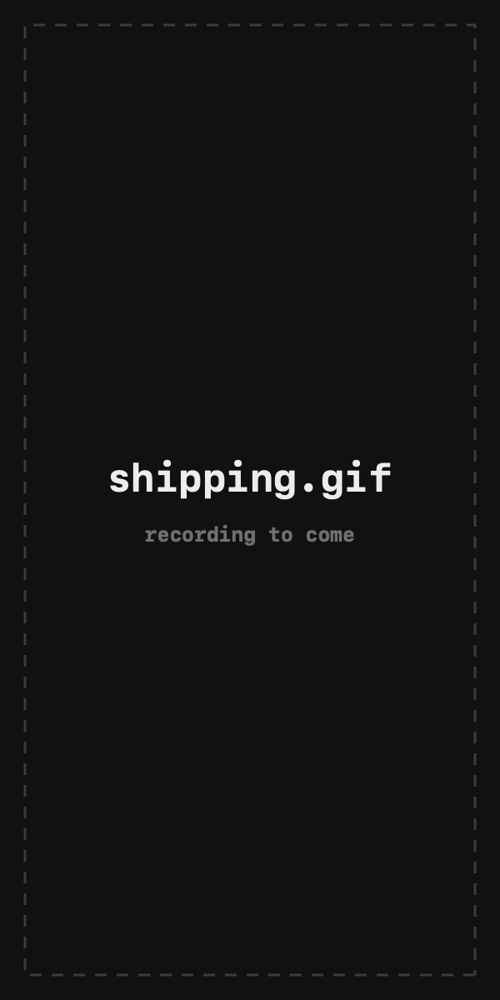
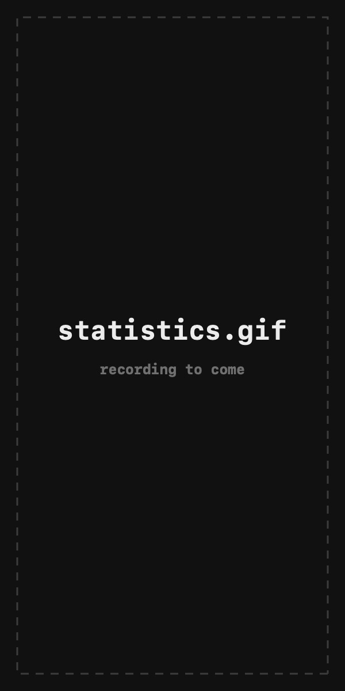
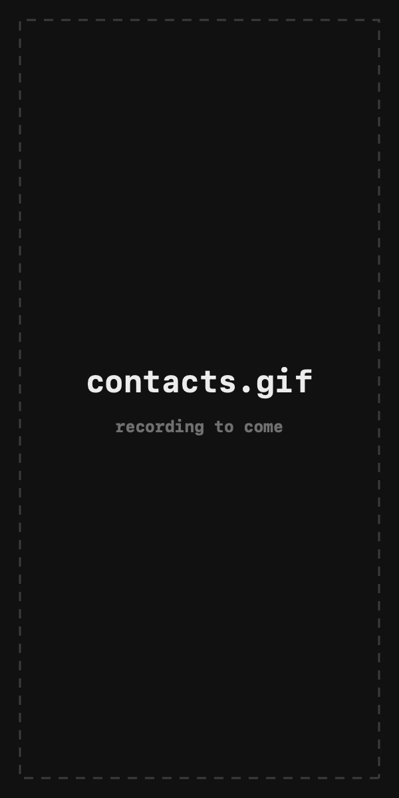
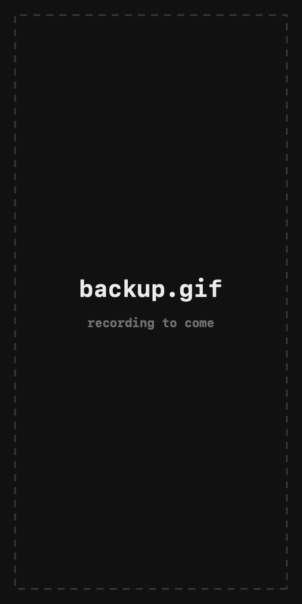

# Papir

**Papir** is an iOS app for writing invoices and keeping stock, built for a small
clothing wholesaler who was doing both on paper. Write an invoice, hand the
customer a clean A4 PDF, and the packs come off the shelf as you ship.

> SwiftUI · SwiftData · CloudKit · no third-party dependencies.

**[Papir on the web](https://kaisse99.github.io/PapirInvoiceGenerator/)** ·
[Support](https://kaisse99.github.io/PapirInvoiceGenerator/support.html) ·
[Privacy](https://kaisse99.github.io/PapirInvoiceGenerator/privacy.html)

---

## Demo

| Writing an invoice | Browsing invoices |
|---|---|
|  |  |

| Invoice detail & editing | Generating a PDF |
|---|---|
|  |  |

| Stock | Shipping an invoice |
|---|---|
|  |  |

| Statistics | Address book |
|---|---|
|  |  |

| Backup & restore | |
|---|---|
|  | |

---

## Features

**Invoices**
- Rows carry a model name, colours, packs, pieces per pack and price, with a live
  total and inline validation.
- Every saved invoice renders a multi-page A4 PDF in **English, Ukrainian,
  Russian or Polish** — the document's language is independent of the app's.
- Each invoice carries a running number and the currency it was written in, so
  changing the currency later never relabels history.
- Searchable and sortable list, filterable to drafts or shipped, with
  multi-select, duplicate and delete.

**Stock**
- Counted in whole packs, by model and by colour, with a state ladder
  (stocked / low / out / negative) that both stock screens share.
- Marking an invoice shipped deducts the packs and writes down exactly what left;
  returning it to draft replays that record rather than recomputing it.
- Overselling is allowed, warned about, and drives the count negative on purpose,
  so a miscount never blocks a real order.
- A movement log records every change: received, removed, shipped, returned,
  recounted.

**Statistics**
- Money by month, year or all time, with a zero-filled Swift Charts line and
  tap-to-inspect.
- Models ranked by profit with their colour breakdown, and buyers by spend,
  both expandable a page at a time.
- Shipped invoices only. A draft is a promise, not money.

**Everything else**
- Address book with city, shipment address and phone, printed under the receiver
  on the PDF.
- iCloud sync, opt-in and off by default, to the user's own private database.
- Excel export of every sheet, and a full JSON backup with a tested restore.
- Four in-app languages, Dynamic Type throughout, and PDFs reachable from Files.

---

## Tech

| | |
|---|---|
| Language | Swift 6.3 (`SWIFT_DEFAULT_ACTOR_ISOLATION = MainActor`) |
| UI | SwiftUI |
| Persistence | SwiftData, versioned schema with a migration plan |
| Sync | CloudKit private database |
| PDF | PDFKit / UIGraphics, rendered off the main actor |
| Spreadsheets | Hand-rolled XLSX + ZIP writer, no library |
| Tests | Swift Testing, 53 tests |
| Minimum OS | iOS 18.0 |
| Dependencies | none |

---

## Architecture

Lightweight MVVM. Views stay thin and declarative, view models own state and
business rules, SwiftData models are the source of truth.

```
Papir/
├── PapirApp.swift          Store loading, CloudKit or local, failure screen
├── Models/                 Invoice, ItemRow, ShipmentLine, StockModel,
│                           StockLine, StockMovement, Contact
├── ViewModels/             ObservableObject view models, one per screen
├── Views/
│   ├── Home/               Drag navigation and the first-run screen
│   ├── NewInvoice/
│   ├── MyInvoices/
│   ├── InvoiceDetail/      Detail, editing and the shipment sheet
│   ├── Stock/
│   ├── Statistics/
│   ├── AddressBook/
│   ├── Settings/
│   ├── PDF/
│   └── Shared/             Design tokens, semantic colours, components
├── Services/               PDF, storage, schema, numbering, shipping,
│                           export, backup, localization
└── Extensions/
```

Every file opens with a header explaining what it does **and why it is the way
it is** — the decisions that were argued through, and what breaks if they are
undone. Those headers are kept accurate; read one before changing the file.

---

## Tests

```bash
xcodebuild -project Papir.xcodeproj -scheme Papir \
  -destination 'platform=iOS Simulator,name=iPhone 17 Pro' test
```

53 tests covering breakdown arithmetic, stock movement, shipping round trips,
statistics aggregates, the zip and xlsx writers, the backup round trip, PDF
rendering in four languages, the CloudKit schema contract, and what happens to a
saved invoice when prices, currency or the shelf change underneath it.

CI runs on `macos-26` because the project needs Xcode 26; an older runner fails
to compile rather than failing a test, which reads like a broken suite and is
not one.

---

## Try it

**[Download on TestFlight](https://testflight.apple.com/join/1QJGaxaS)** — you
will need the free [TestFlight app](https://apps.apple.com/app/testflight/id899247664).

---

## Design

Monospaced typography throughout, because this is an app about columns of
numbers. Four semantic colours and no others: **ink** for the default voice,
**blue** for shipped, **red** for a stock count in trouble, **amber** for
"look at this, but nothing is broken". A radial wash behind every screen and a
paperclip mark as the brand.

---

## Privacy

No account, no analytics, no tracking, no ads, no third-party SDKs. Data lives on
device, or in the user's own private iCloud database if they turn sync on. The
developer has no server and cannot read any of it.

---

## License

Papir is **source-available**. You may download, use and run it in your own
business at no cost, and study, modify and contribute to the code. **You may not
resell Papir or offer it as a paid or subscription product** without prior
written permission. See [LICENSE](LICENSE).

---

## Author

**Mykyta Varnikov** — built as a fast, quiet utility for one real person who was
tired of writing invoices by hand.
