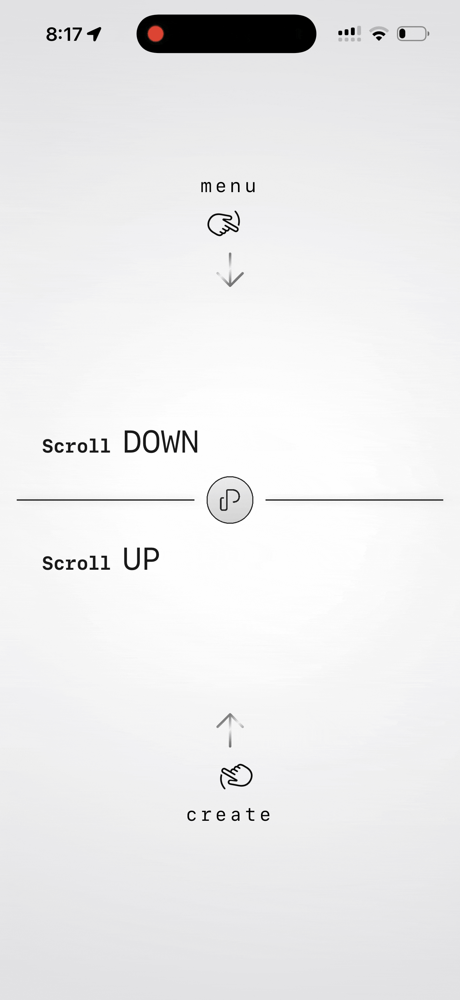
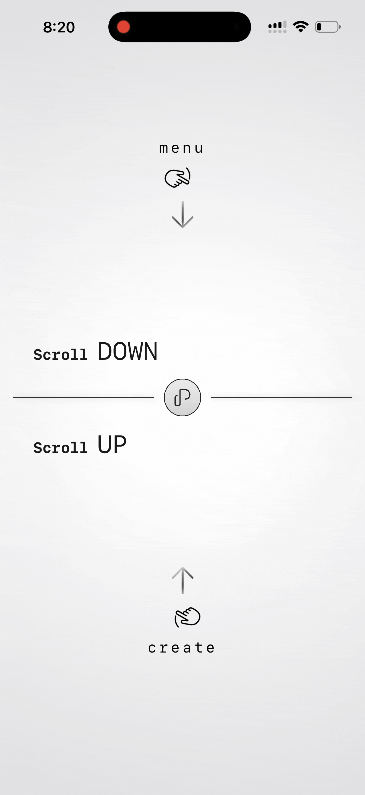
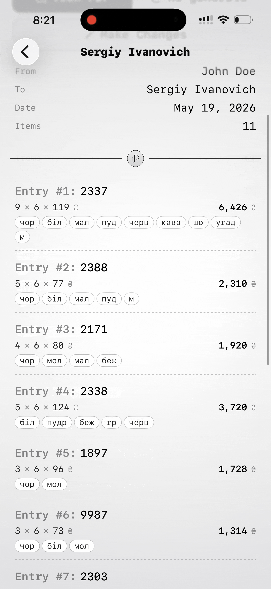

# Papir

**Papir** is an iOS app for creating, managing, and exporting invoices, built for small businesses. It was created to help a small wholesale business owner replace handwritten paper invoices with a fast, clean digital workflow.

> Built with SwiftUI and SwiftData.

---

## Demo

| Creating an invoice | Browsing invoices |
|---|---|
|  |  |

| Invoice details & editing | Generating a PDF |
|---|---|
|  |  |

---

## Features

- **Gesture-driven navigation** :: swipe up to create, swipe down to browse. A custom rubber-band drag with layered haptic feedback.
- **Invoice builder** :: add line items with units, per-unit counts, price, and color tags. Live total updates as you type, with inline validation.
- **Automatic PDF generation** :: every saved invoice produces a clean, multi-page A4 PDF, generated in Ukrainian by default.
- **Multi-language PDF export** :: regenerate any invoice's PDF in Ukrainian, Russian, or English, with locale-aware dates and labels.
- **Invoice management** :: searchable, sortable list of all invoices (by date or total), with multi-select, duplicate, and delete.
- **Files app integration** :: generated PDFs are saved to a visible folder, accessible outside the app.
- **Local-first** :: all data is stored on-device with SwiftData. No account, no cloud, no tracking.

---

## Tech Stack

- **Language:** Swift
- **UI:** SwiftUI
- **Persistence:** SwiftData
- **PDF:** PDFKit / UIGraphics
- **Architecture:** MVVM
- **Minimum OS:** iOS 26

---

## Architecture

Papir uses a lightweight MVVM structure. Views stay thin and declarative, ViewModels own state and business logic, SwiftData models are the source of truth for persistence.

```
Papir/
├── PapirApp.swift
├── Models/            SwiftData models (Invoice, ItemRow)
├── ViewModels/        ObservableObject view models
├── Views/             SwiftUI views, grouped by screen
│   ├── Home/
│   ├── NewInvoice/
│   ├── MyInvoices/
│   ├── InvoiceDetail/
│   ├── PDF/
│   └── Shared/        Reusable components
├── Services/          PDF generation and storage
└── Extensions/        Shared helpers and design tokens
```

---

## Try It

Papir is available for testing and use via TestFlight:

**[Download on TestFlight](https://testflight.apple.com/join/1QJGaxaS)**

You'll need the free [TestFlight app](https://apps.apple.com/app/testflight/id899247664) installed first.

---

## Design

Papir uses a deliberately minimal visual language: monospaced typography throughout, a restrained two-color palette, soft radial backgrounds, and a consistent paperclip motif as a brand element. The goal is a tool that feels calm, fast, and precise.

---

## License

Papir is **source-available**.

You're free to download, use, and even run it in your own business at no
cost, and to study, modify, and contribute to the code. **You may not
resell Papir or offer it as a paid or subscription-based product**
without prior written permission. See [LICENSE](LICENSE) for full terms.

---

## Author

**Mykyta Varnikov**

Built as a simple, quick, and convinient utility app for a real person.
